### About Me

  
  

Chemist-turned-developer working as Software Developer at **Hess Services Inc.** I build internal tools, ERP integrations, and automation systems for manufacturing environments. My day-to-day spans Python and Rust CLI tools, dashboards, AWS infrastructure, and database work across SQL Server and MySQL.

**Background:** Dual B.S. in Chemistry & Mathematics from Linfield College, M.S. in Chemistry from the University of Oregon.

---

### Tech Stack

  
  
  
  
  
  
  
  
  
  

  
  
  
  
  

---

### Featured Projects

<table>
  <tr>
    <td width="33%" valign="top">
      <h3 align="center">st-rsuite</h3>
      

        
      

      

        RSuite date and time components for Streamlit. Date pickers, time pickers, and range selectors built with Components v2 (fully open source).
      

      

        
        
        
      

    </td>
    <td width="33%" valign="top">
      <h3 align="center">drone-vantage</h3>
      

        
        
      

      

        Find the best drone launch spots and where you can legally fly within line of sight. Viewshed over real elevation and satellite tree cover, with FAA airspace ceilings.
      

      

        
        
        
      

    </td>
    <td width="33%" valign="top">
      <h3 align="center">st-custom-static</h3>
      

        
        
      

      

        Drop-in replacements for Streamlit's default loading animation. Swap the running man for one of 13 polished alternatives in seconds.
      

      

        
        
        
      

    </td>
  </tr>
  <tr>
    <td width="33%" valign="top">
      <h3 align="center">streamlit-aggrid-v2</h3>
      

        
        
      

      

        AG Grid tables for Streamlit. Interactive editing, filtering, sorting, and grouping, built on AG Grid v34 with Custom Components v2.
      

      

        
        
        
      

    </td>
    <td width="33%" valign="top">
      <h3 align="center">clblast-llama-cpp-python</h3>
      

        
      

      

        Guide to compile llama.cpp with CLBlast GPU acceleration for older AMD GPUs lacking ROCm support.
      

      

        
        
      

    </td>
    <td width="33%" valign="top">
      <h3 align="center">high-freq-forex-bot</h3>
      

        
      

      

        Finds and exploits arbitrage opportunities in the international currency exchange market using high-frequency forex trading.
      

      

        
        
      

    </td>
  </tr>
</table>

---

### GitHub Stats

  <picture>
    <source media="(prefers-color-scheme: dark)" srcset="./profile/stats-dark.svg" />
    
  </picture>

  <a href="https://git.io/streak-stats">
    <picture>
      <source media="(prefers-color-scheme: dark)" srcset="./profile/streak-dark.svg" />
      
    </picture>
  </a>

  <picture>
    <source media="(prefers-color-scheme: dark)" srcset="./profile/top-langs-dark.svg" />
    
  </picture>

